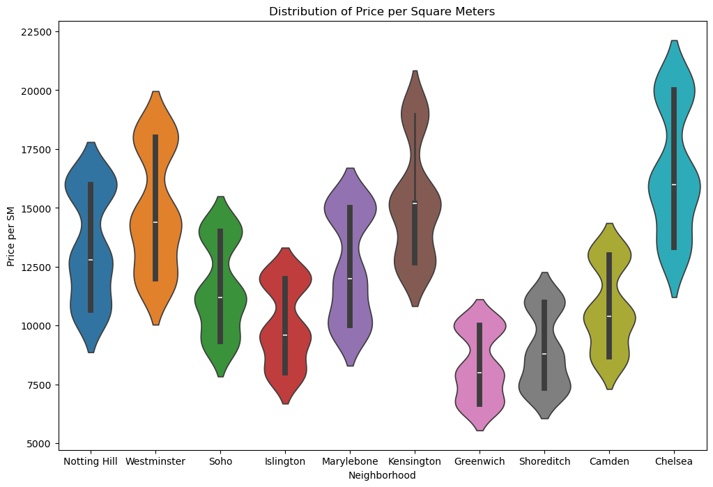

# Analysis and Prediction of House Prices in London

This project aims to analyze the **"London_Houses"** dataset, exploring patterns and factors that influence house prices in the region. An **exploratory data analysis (EDA)** was conducted to identify trends and correlations between variables such as location, number of bedrooms, and property size.

Additionally, different **machine learning models** were trained to predict house values based on their characteristics. The performance of the models was evaluated and compared using metrics such as **Mean Absolute Error (MAE), Mean Squared Error (MSE), and R²**, ensuring the selection of the best approach for the problem.

## 📌 Dataset

**About Dataset**

This dataset contains various characteristics and price information about houses in London. Consisting of 1000 entries, it reflects many aspects of each house, from location to interior design. In addition to physical features such as the address, neighborhood, number of rooms, and square footage, it also includes more specific details like the age of the building, garage availability, and balcony presence. Furthermore, the price of each house provides valuable insights into its market value.

**Columns**

| Column         | Description |
|-----------------|-------------|
| **Address**     | Address of the house |
| **Neighborhood** | Neighborhood of the house |
| **Bedrooms**    | Number of bedrooms |
| **Bathrooms**   | Number of bathrooms |
| **Square Meters** | Square meters |
| **Building Age** | Age of the building |
| **Garden**      | Garden (Yes/No) |
| **Garage**      | Garage (Yes/No) |
| **Floors**      | Number of floors |
| **Property Type** | Property type (House / Apartment / Semi-Detached) |
| **Heating Type** | Type of heating |
| **Balcony**     | Type of balcony |
| **Interior Style** | Interior style (Industrial / Classic / Modern) |
| **View**        | View from the house |
| **Materials**   | Construction material |
| **Building Status** | Building condition |
| **Price**       | Property price |

## 📌 Insights

According to the exploratory data analysis, it was discovered that Chelsea is the neighborhood with the most expensive houses in London, according to the dataset.

**Neighborhood Price (Mean)**
| Neighborhood | Price |
|--------------|-------|
| Chelsea | 2382549.36 |
| Kensington |	2245121.01 |	
| Westminster	| 2178116.13 |
| Notting Hill |	1957588.57 |	
| Marylebone |	1824982.30 |	
| Soho | 1781120.77	|
| Camden | 1626332.17	|
| Islington	| 1507373.20	|
| Shoreditch |	1332828.89	|
| Greenwich	| 1269408.81	 |

 In the graphic below, we can see the distribution of prices per square meter for each neighborhood. 
**Project:** [Notebook](Houses_london_analysis.ipynb)

